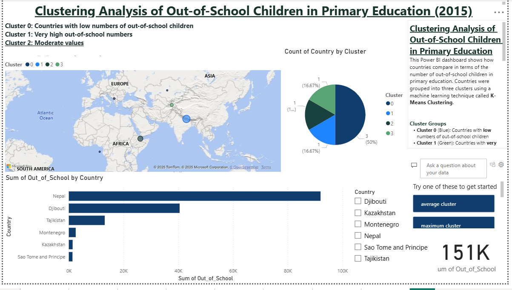
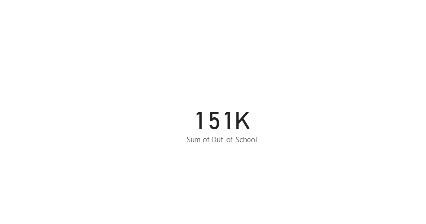

# Clustering Analysis of Out-of-School Children in Primary Education

**Cedrick Rukundo**  
ID: 27946  
Group E  
Course: Introduction to Big Data Analytics  

---

## Project Overview

This project explores the clustering of countries based on the number of out-of-school children in primary education using Power BI. The goal is to identify countries with high, moderate, and low out-of-school populations through cluster analysis.

---

## 📌 Dashboard Visualizations

### 1. HEAD

### 2. Summary

### 3. Cluster Map  
Shows geographic distribution of countries grouped into three clusters.

### 4. Pie Chart – Count by Cluster  
Displays how many countries belong to each cluster.

### 5. Bar Chart – Sum of Out-of-School by Country  
Visualizes the total number of out-of-school children per country.

### 6. Summary Card  
Highlights total number of out-of-school children across all countries.

---

## Key Insights

- Nepal accounts for over 60% of the total out-of-school children in the dataset.  
- Cluster 1 represents countries with very high out-of-school numbers.  
- Cluster 0 includes countries with low numbers, like São Tomé and Príncipe.  
- The data emphasizes regional disparities in access to primary education.

---

##  How to Open the Dashboard

1. Download `Education BI.pbix`
2. Open it using [Microsoft Power BI Desktop](https://powerbi.microsoft.com/desktop)
3. Explore each visualization as attached to gain deeper insights.

---

##  Author

## Cedrick Rukundo  
## ID 27946
## Introduction to Big Data
## Adventist University of Central Africa (AUCA)

---

